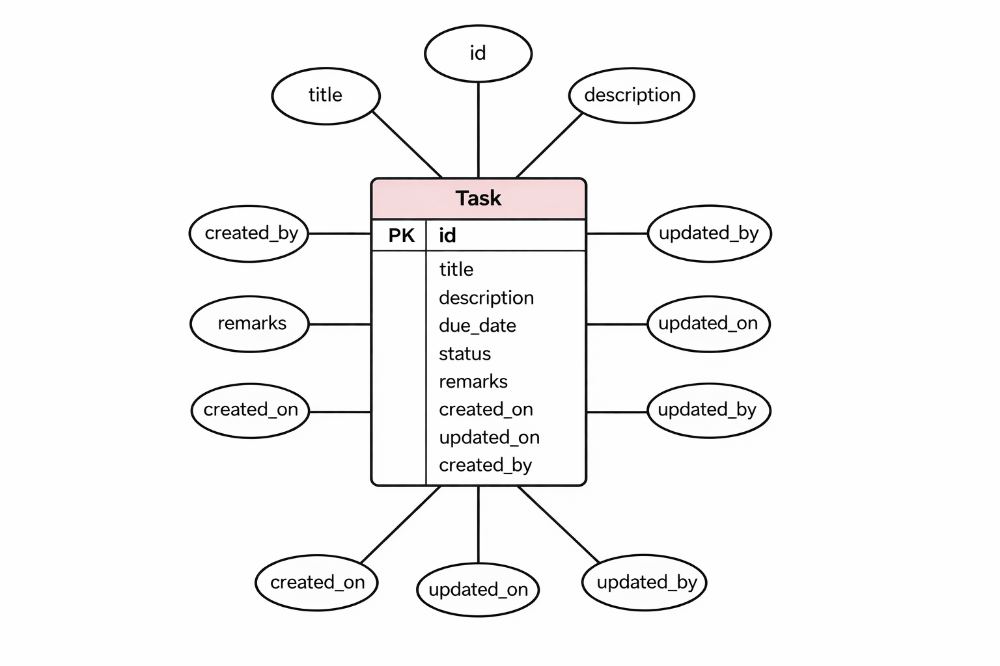
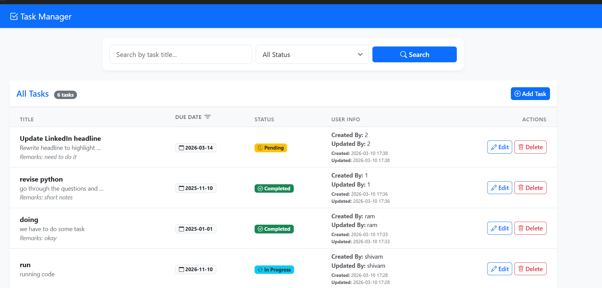
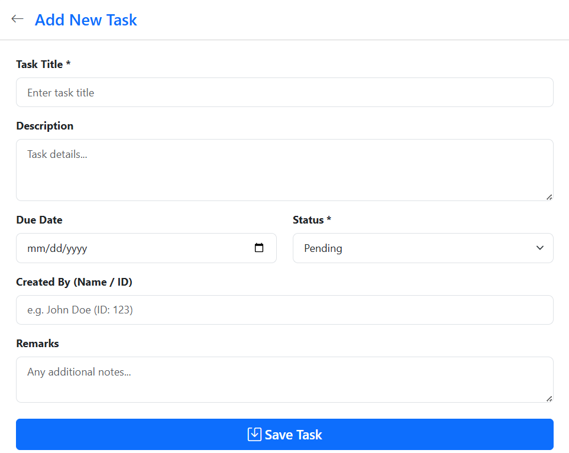
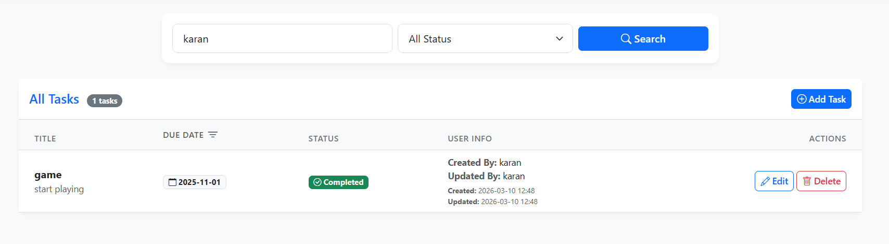
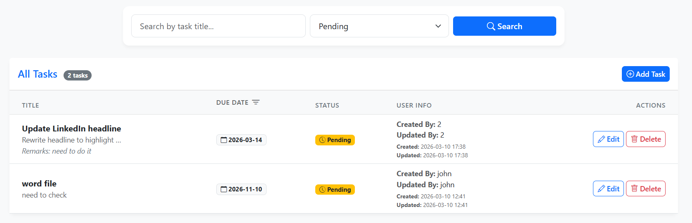

# Task Management Application

## 2.1.1. Full working demo
The whole code is hosted on a Github public repository and can be accessed directly without the need for any special permission.
``` https://github.com/kumudkode/TaskManager ```

## 2.1.2. Document the entire project in Github
The entire project documentation is provided here in `README.md`.

## 2.1.3.1. Overview of Project
This is a robust, web-based Task Management Application focusing on CRUD (Create, Read, Update, Delete) operations and dynamic search capabilities. Built using Python, Flask, SQLite, and Bootstrap, this application helps users efficiently create, store, and manage their tasks.

## 2.1.3.2. Explanation of DB Design
The application uses **SQLite** combined with **Flask-SQLAlchemy** as its underlying database architecture to securely store data interactively.

### 2.1.3.2.1. ER Diagram

                +----------------------+
                |         TASK         |
                +----------------------+
                | Primary Key  id      |
                |----------------------|
                | title                |
                | description          |
                | due_date             |
                | status               |
                | remarks              |
                | created_on           |
                | updated_on           |
                | created_by           |
                | updated_by           |
                +----------------------+

### 2.1.3.2.2. Data Dictionary
| Field | Data Type | Properties | Description |
|-------|-----------|------------|-------------|
| `id` | Integer | Primary Key | Unique identifier for each task. |
| `title` | String(255) | Not Null | The main headline or name of the task. |
| `description` | Text | Nullable | A detailed background elaboration about the task. |
| `due_date` | String(10) | Nullable | Target completion date formatted as YYYY-MM-DD. |
| `status` | String(50) | Not Null, Default: 'Pending' | Current stage (e.g., Pending, In Progress, Completed). |
| `remarks` | Text | Nullable | Additional context or comments. |
| `created_on` | DateTime | Default: `datetime.utcnow` | Auto-recorded timestamp of task creation. |
| `updated_on` | DateTime | Default: `datetime.utcnow` | Auto-recorded timestamp capturing recent modification. |
| `created_by` | String(100) | Nullable | The user who originally created the item. |
| `updated_by` | String(100) | Nullable | The user who last modified the item. |

### 2.1.3.2.3. Documentation of Indexes used
- **Primary Key Index on `id`:** The relational database automatically creates a unique index on the primary key `id` column to efficiently fetch, update, and sort records by their primary identifier. 
- *No additional custom or composite indexing rules were defined, as the data model is simple and unified.*

### 2.1.3.2.4. Whether Code first of DB First approach has been used and why?
A **Code First** (Model First / Object Relational Mapping) approach was utilized through Flask-SQLAlchemy. 
**Why?**
We define database schemas dynamically using Python classes (e.g., `class Task(db.Model)`) instead of writing raw SQL structural component scripts manually. The ORM mechanism translates and generates database schemas automatically (`db.create_all()`). This encapsulates our database architecture directly into programmatic logical models, facilitating simpler, secure integration alongside version control directly inside `app.py`, without requiring the developer to execute any disjoint DB setup or SQL syntax before operating the application.

## 2.1.3.3. Structure of the application detailing -
### 2.1.3.3.2. Standard MVC server side page rendering has been used. Any of the SPA or MPA approaches can be used
We adopted a **Standard MVC (Model-View-Controller) server-side page rendering** strategy natively, classifying it structurally as a Multi-Page Application (MPA). 

* **Model:** Handles relational object mapping connecting to the underlying SQLite database seamlessly using SQLAlchemy definitions within `app.py`.

* **View:** Built out safely rendering frontend user representations mainly utilizing flexible HTML paired structurally with Jinja2 template bindings (`templates/*.html`).
* **Controller:** Expressed explicitly through standard scalable Flask view router endpoints (`@app.route(...)`) dictating and mapping programmatic logic to template payloads and managing dynamic client requests reliably.

## 2.1.3.4. Frontend Structure -
### 2.1.3.4.1. What kind of frontend has been used and why?
A standard robust **web page frontend** using base interactive HTML/CSS alongside a modernized CSS interface layout framework (`Bootstrap`).

**Why?**
- **Simplicity & Speed:** Minimizes external dependency weight drastically compared to single-page application frameworks structurally (e.g., React/Angular/Vue), while producing dynamic, rapid structurally sound web formatting responsively leveraging predefined Bootstrap utilities deeply.

- **Immediate Server-Rendered Availability:** Jinja2 integrates logic natively into structural markup resolving rapidly via direct HTTP routing configurations.

### 2.1.3.4.2. Candidates can either use a web page frontend or a mobile application. Any of these are okay.
A **web page frontend** has been used as it satisfies the assignment requirements efficiently while being universally accessible via standard web browsers natively capable of responsive scaling.

## 2.1.3.5. Build and install -

### 2.1.3.5.1. Environment details along with list of dependencies
**Environment Details:** Local generic Python 3.x execution environment.

**List of Dependencies:**
- `Flask`: High-velocity routing framework logic handler.
- `Flask-SQLAlchemy`: Lightweight interface component dynamically attaching ORM database modeling functionality directly interacting inside the runtime context effortlessly.

### 2.1.3.5.2. Instructions on how to compile or build a project.
Given Python functions reliably as a purely interpreted procedural scripting language parsing natively over execution, additionally dynamically creating SQLite schemas safely during start procedures (`db.create_all()`), external discrete traditional build and separate compilation deployment pipeline actions are entirely unnecessary.

### 2.1.3.5.3. Instructions on how to run or install the project
1. **Clone the Repository:** Open your terminal and clone the repository to your local machine:
   ```bash
   git clone https://github.com/kumudkode/TaskManager.git
   cd TaskManager
   ```

2. **Verify Python Installation:** Ensure a functional Python 3 environment is operational locally (`python --version`).

3. **Set Up a Virtual Environment (Recommended):** This keeps project dependencies isolated.
   ```bash
   python -m venv .venv
   ```
   **Activate the virtual environment:**
   - On Windows: `.\.venv\Scripts\activate`
   - On macOS/Linux: `source .venv/bin/activate`

4. **Install Dependencies:** Install the required environment packages utilizing PIP:
   ```bash
   pip install flask flask-sqlalchemy
   ```

5. **Run the Application:** Boot the local web server process (this also triggers initial baseline dynamic `.db` local schema file injection setup):
   ```bash
   python app.py
   ```

6. **Access the App:** Open the functional interface explicitly in a web browser at: `http://localhost:5000/`.

## 2.1.3.6. General Documentation not covered here

### Choice of Technologies
Based on the choices provided in the assignment, here are the selected technologies:
- **Programming Language:** Python
- **RDBMS:** SQLite (Provides robust functionality within Python natively. Since SQLAlchemy ORM is used, switching seamlessly to PostgreSQL, MySQL, Oracle, or MS SQL Server requires only modifying the database URI connection string securely).
- **Backend Modules (MVC/API):** MVC-based logic using Flask Framework.
- **Frontend Module:** Standard MVC/MPA based web page frontend using HTML, CSS, Jinja2 natively, and Bootstrap.

### Additional Features
The application implements robust **search filtering** directly within the base routing index, searching dynamically against task titles, descriptions, and remarks. Status-based categorical filtering and directional sorting functionalities based on target creation/due dates are natively supported.

### Demo Image






